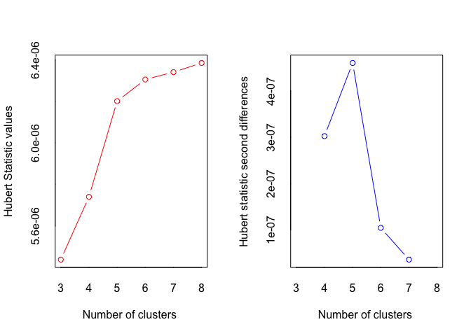
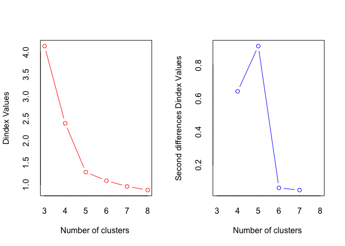
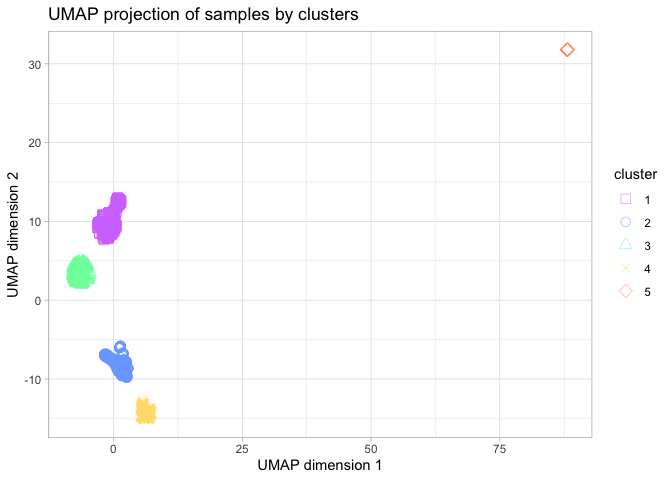

# Import necessary libraries

```r
library(readr)
library(NbClust)
library(factoextra)
library(umap)
library(ggplot2)
```

# Open the data

To inspect the results of NbClust we will use the filtered data without scaling. 
To make clusters around samples we need to transpose our data frame.

```r
setwd('/Volumes/TOSHIBA EXT/4t curs/Advanced Bioinformatics/Project/Python/')
data <- read_csv("filtered_data.csv")
row_names <- data$gene_id
data <- data[-1]
t_data <- t(data)
```

# Clustering

As in the notebook Kmeans_clustering we saw that PCA don't work properly with our data, we will apply UMAP as dimensionality reduction method. Then, in the NbClust we wil set the parameters of distance to be euclidean, and we will use Ward D2 as clustering method.

```r
umap_result <- umap(t_data, n_components = 2)

nb <- NbClust(data = umap_result$layout, distance = "euclidean", min.nc = 3, 
              max.nc = 8, method = "ward.D2", index = "all") 
```

<!-- -->

```
## *** : The Hubert index is a graphical method of determining the number of clusters.
##                 In the plot of Hubert index, we seek a significant knee that corresponds to a 
##                 significant increase of the value of the measure i.e the significant peak in Hubert
##                 index second differences plot. 
## 
```

<!-- -->

```
## *** : The D index is a graphical method of determining the number of clusters. 
##                 In the plot of D index, we seek a significant knee (the significant peak in Dindex
##                 second differences plot) that corresponds to a significant increase of the value of
##                 the measure. 
##  
## ******************************************************************* 
## * Among all indices:                                                
## * 6 proposed 3 as the best number of clusters 
## * 5 proposed 4 as the best number of clusters 
## * 8 proposed 5 as the best number of clusters 
## * 1 proposed 6 as the best number of clusters 
## * 3 proposed 7 as the best number of clusters 
## * 1 proposed 8 as the best number of clusters 
## 
##                    ***** Conclusion *****                            
##  
## * According to the majority rule, the best number of clusters is  5 
##  
##  
## *******************************************************************
```

```r
nb$All.index
```

```
##        KL        CH  Hartigan      CCC     Scott    Marriot      TrCovW
## 3  4.3117  7509.355 2548.3833  74.5759  8677.396 3160962688 217598786.7
## 4  1.0464 12247.651 5722.4479  98.3888 13251.958  568657699 213436465.0
## 5 12.9924 36972.556  858.4760 156.7513 17241.092  120542536   3947371.2
## 6  1.2611 42475.415  750.2086 159.0249 18847.014   77670742   3812695.4
## 7  6.6019 48833.952  348.0736 162.6044 19972.352   60175497   1241337.8
## 8  1.9910 49204.042  280.5975 160.0619 20573.338   58170826    911218.5
##      TraceW Friedman    Rubin Cindex     DB Silhouette   Duda  Pseudot2  Beale
## 3 38923.532  16.0364   8.5320 0.3752 0.3288     0.7327 0.1126 9016.2909 7.8745
## 4 17086.520  74.5841  19.4360 0.2772 0.2527     0.7568 0.1148 6440.7526 7.7042
## 5  4413.669 149.9863  75.2421 0.3065 0.2581     0.7927 0.3963 1000.6638 1.5208
## 6  3084.407 240.0660 107.6685 0.2948 0.3221     0.7397 0.4156  732.6836 1.4036
## 7  2240.273 306.2570 148.2380 0.3517 0.4608     0.6833 0.5995  351.3442 0.6667
## 8  1906.759 346.1846 174.1666 0.3164 0.6212     0.6350 0.2602  494.7228 2.8270
##   Ratkowsky       Ball Ptbiserial   Frey McClain   Dunn Hubert SDindex Dindex
## 3    0.5424 12974.5107     0.6428 1.7254  0.2354 0.7201      0  0.3138 4.1382
## 4    0.4870  4271.6300     0.5623 0.7624  0.3499 0.3703      0  0.3893 2.3884
## 5    0.4442   882.7338     0.5326 2.1581  0.3064 0.6637      0  0.4014 1.2810
## 6    0.4063   514.0679     0.4967 2.3508  0.3257 0.0992      0  0.9651 1.0876
## 7    0.3766   320.0390     0.4616 4.2823  0.3479 0.0306      0  1.4023 0.9566
## 8    0.3525   238.3449     0.4145 1.5474  0.4123 0.0306      0  2.5731 0.8748
##     SDbw
## 3 0.0772
## 4 0.0325
## 5 0.0096
## 6 0.0109
## 7 0.0210
## 8 0.0490
```

```r
nb$Best.nc
```

```
##                      KL       CH Hartigan      CCC    Scott    Marriot
## Number_clusters  5.0000     8.00    5.000   7.0000    4.000          4
## Value_Index     12.9924 49204.04 4863.972 162.6044 4574.563 2144189827
##                    TrCovW   TraceW Friedman    Rubin Cindex     DB Silhouette
## Number_clusters         5     5.00   6.0000   5.0000 4.0000 4.0000     5.0000
## Value_Index     209489094 11343.59  90.0797 -23.3796 0.2772 0.2527     0.7927
##                   Duda PseudoT2  Beale Ratkowsky     Ball PtBiserial   Frey
## Number_clusters 7.0000   7.0000 5.0000    3.0000    4.000     3.0000 3.0000
## Value_Index     0.5995 351.3442 1.5208    0.5424 8702.881     0.6428 1.7254
##                 McClain   Dunn Hubert SDindex Dindex   SDbw
## Number_clusters  3.0000 3.0000      0  3.0000      0 5.0000
## Value_Index      0.2354 0.7201      0  0.3138      0 0.0096
```
To visualize the best partition based on all the calculated indexes, we will save it in the variable bclust_labels.

```r
bclust_labels <- nb$Best.partition
table(bclust_labels)
```

```
## bclust_labels
##   1   2   3   4   5 
## 659 523 487 314  14
```

# UMAP projection of the results


```r
umap_df <- data.frame(x = umap_result$layout[, 1], y = umap_result$layout[, 2], cluster = as.factor(bclust_labels))

shapes = c(0, 1, 2, 4, 5)
cols = c('#D27BFF', '#7BAAFF', '#7BFFAA', '#FFDD7B', '#FF9E7B')

ggplot(umap_df, aes(x=x, y=y, color=cluster, shape=cluster)) + 
  xlab('UMAP dimension 1') + ylab('UMAP dimension 2') + 
  geom_point(alpha=.5, size=3) +
  scale_shape_manual(values = shapes) +
  scale_color_manual(values = cols) +
  ggtitle('UMAP projection of samples by clusters') +
  theme_light()
```

<!-- -->
After inspecting the UMAP projection of the clustering best result, we exclude cluster 5 samples of our project as probably there's some technical issue with them; and they could distort scaling results. 
Now this filtered data needs to be scaled, and then we will run the clustering again, obtaining the final groups of samples.

```r
final_data <- data[bclust_labels!=5]
rownames(final_data) <- row_names
write.csv(final_data, "Rfiltered_data.csv", row.names = TRUE)
```
