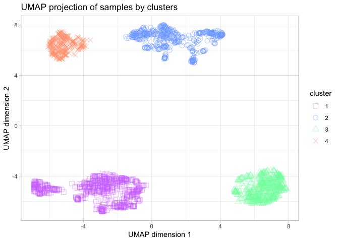

# Import necessary libraries


```r
install.packages('readr')
BiocManager::install('NbClust')
BiocManager::install('umap')
install.packages('ggplot2')
```


```r
library(readr)
library(NbClust)
library(umap)
library(ggplot2)
```

# Open the data

To get the final groups of samples, we will use the previously scaled data using Python; and the same methods applied in the R Markdown clustering_R. **IMPORTANT NOTE**: Because of the complexity of our data and to obtain some results, here we perform the clustering onto the UMAP dimentions to simplify a lot the input matrix used on NbClust, but this mustn't be done like this. The correct way to perform clustering is on the scaled data, and then UMAP can be used for visualization purposes.

```r
setwd('/Volumes/TOSHIBA/4t/Advanced Bioinformatics/Project/Python/')
data <- read_csv("scaled_data.csv")
data <- data[-1]
t_data <- t(data)
d_matrix <- data.matrix(t_data, rownames.force = NA)
```

# Clustering


```r
umap_result <- umap(t_data, n_components = 2)

nb <- NbClust(data = umap_result$layout, distance = "euclidean", min.nc = 2, 
              max.nc = 8, method = "ward.D2", index = "all") 
```

<!-- -->

```
## *** : The Hubert index is a graphical method of determining the number of clusters.
##                 In the plot of Hubert index, we seek a significant knee that corresponds to a 
##                 significant increase of the value of the measure i.e the significant peak in Hubert
##                 index second differences plot. 
## 
```

<!-- -->

```
## *** : The D index is a graphical method of determining the number of clusters. 
##                 In the plot of D index, we seek a significant knee (the significant peak in Dindex
##                 second differences plot) that corresponds to a significant increase of the value of
##                 the measure. 
##  
## ******************************************************************* 
## * Among all indices:                                                
## * 2 proposed 2 as the best number of clusters 
## * 3 proposed 3 as the best number of clusters 
## * 11 proposed 4 as the best number of clusters 
## * 1 proposed 5 as the best number of clusters 
## * 1 proposed 6 as the best number of clusters 
## * 1 proposed 7 as the best number of clusters 
## * 2 proposed 8 as the best number of clusters 
## 
##                    ***** Conclusion *****                            
##  
## * According to the majority rule, the best number of clusters is  4 
##  
##  
## *******************************************************************
```

```r
nb$All.index
```

```
##        KL        CH  Hartigan      CCC     Scott   Marriot    TrCovW    TraceW
## 2  1.2942  3616.774 2382.5752  26.2078  8134.847 133196971 409118558 33476.516
## 3  0.7852  5172.034 4564.4366  47.3304  9784.788 130414369  76022379 15197.854
## 4 14.2074 12911.604  782.1823  97.2356 12559.950  57202883   6652789  4598.066
## 5  0.6252 13699.721  937.4686  96.6691 13450.773  57034775   3145670  3295.535
## 6  5.0912 16333.370  437.7787 103.4979 14840.992  40741030   1982362  2235.856
## 7  1.1093 16689.653  382.0743 102.6314 15702.473  35913168   1124769  1830.514
## 8  2.4300 17117.391  288.0256 102.4481 16338.865  34030014    598774  1533.920
##   Friedman   Rubin Cindex     DB Silhouette   Duda  Pseudot2  Beale Ratkowsky
## 2  57.5580  2.8257 0.3651 0.7252     0.6204 0.1319 7429.5509 6.5748    0.4212
## 3  59.4228  6.2243 0.2890 0.4542     0.7008 0.1466 4949.2893 5.8159    0.5060
## 4  68.9561 20.5729 0.3072 0.3532     0.7647 0.4112  932.1807 1.4297    0.4841
## 5  74.3297 28.7042 0.2816 0.4035     0.7165 0.3465 1009.1341 1.8827    0.4375
## 6  96.3652 42.3085 0.3133 0.5017     0.6765 0.5390  446.4198 0.8536    0.4026
## 7 127.7568 51.6771 0.3073 0.6511     0.6470 0.4755  525.0749 1.1008    0.3735
## 8 146.7436 61.6692 0.2760 0.7693     0.5611 0.4405  442.0694 1.2667    0.3501
##         Ball Ptbiserial   Frey McClain   Dunn Hubert SDindex Dindex   SDbw
## 2 16738.2581     0.8222 0.6752  0.3685 0.6135      0  0.7222 3.8117 0.4523
## 3  5065.9513     0.8362 0.3588  0.5228 0.3089      0  0.4084 2.2676 0.1666
## 4  1149.5165     0.8537 1.2241  0.4803 0.5070      0  0.2985 1.3198 0.0476
## 5   659.1070     0.8094 1.2288  0.5120 0.1325      0  0.5327 1.1275 0.0377
## 6   372.6427     0.7597 2.0446  0.5433 0.0536      0  0.6447 0.9630 0.0483
## 7   261.5021     0.6924 2.2162  0.6234 0.0439      0  1.0902 0.8689 0.0983
## 8   191.7400     0.6279 1.7770  0.7238 0.0276      0  1.2216 0.7950 0.1070
```

```r
nb$Best.nc
```

```
##                      KL       CH Hartigan      CCC    Scott  Marriot    TrCovW
## Number_clusters  4.0000     8.00    4.000   6.0000    4.000        4         3
## Value_Index     14.2074 17117.39 3782.254 103.4979 2775.162 73043378 333096179
##                   TraceW Friedman   Rubin Cindex     DB Silhouette Duda
## Number_clusters    4.000   7.0000  4.0000  8.000 4.0000     4.0000   NA
## Value_Index     9297.257  31.3917 -6.2174  0.276 0.3532     0.7647   NA
##                 PseudoT2  Beale Ratkowsky     Ball PtBiserial Frey McClain
## Number_clusters       NA 4.0000     3.000     3.00     4.0000    1  2.0000
## Value_Index           NA 1.4297     0.506 11672.31     0.8537   NA  0.3685
##                   Dunn Hubert SDindex Dindex   SDbw
## Number_clusters 2.0000      0  4.0000      0 5.0000
## Value_Index     0.6135      0  0.2985      0 0.0377
```


```r
bclust_labels <- nb$Best.partition
table(bclust_labels)
```

```
## bclust_labels
##   1   2   3   4 
## 653 537 478 315
```

# UMAP projection of the results


```r
umap_df <- data.frame(x = umap_result$layout[, 1], y = umap_result$layout[, 2], cluster = as.factor(bclust_labels))

shapes = c(0, 1, 2, 4,5)
cols = c('#D27BFF', '#7BAAFF', '#7BFFAA', '#FF9E7B', 'yellow')

ggplot(umap_df, aes(x=x, y=y, color=cluster, shape=cluster)) + 
  xlab('UMAP dimension 1') + ylab('UMAP dimension 2') + 
  geom_point(alpha=.5, size=3) +
  scale_shape_manual(values = shapes) +
  scale_color_manual(values = cols) +
  ggtitle('UMAP projection of samples by clusters') +
  theme_light()
```

<!-- -->
We can conclude that we have 4 well defined groups of samples, so we are going to store in a file to which cluster each sample belongs, for further analysis.

```r
write.csv(bclust_labels, "cluster_labs.csv", row.names = TRUE)
```
