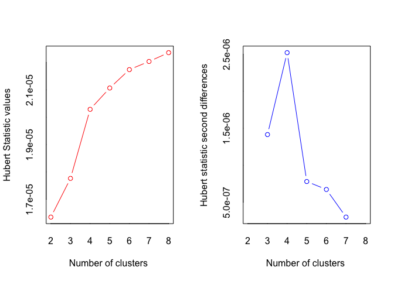
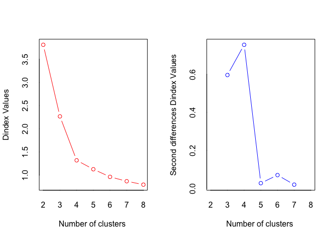
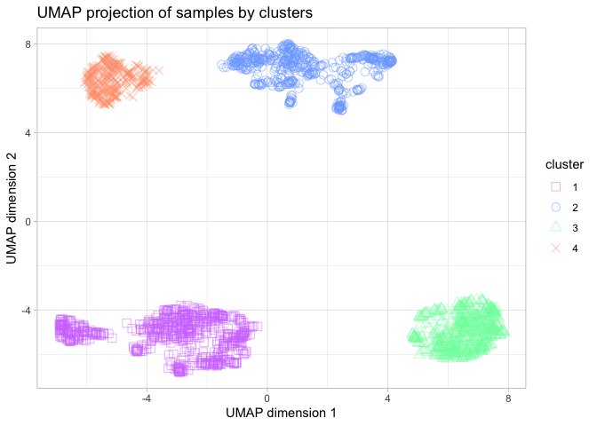

# Import necessary libraries


```r
library(readr)
library(NbClust)
library(factoextra)
library(umap)
library(ggplot2)
```

# Open the data

To get the final groups of samples, we will use the previously scaled data using Python; and the same methods applied in the R Markdown clustering_R.

```r
setwd('/Volumes/TOSHIBA EXT/4t curs/Advanced Bioinformatics/Project/Python/')
data <- read_csv("scaled_data.csv")
data <- data[-1]
t_data <- t(data)
```

# Clustering


```r
umap_result <- umap(t_data, n_components = 2)

nb <- NbClust(data = umap_result$layout, distance = "euclidean", min.nc = 3, 
              max.nc = 8, method = "ward.D2", index = "all") 
```

<!-- -->

```
## *** : The Hubert index is a graphical method of determining the number of clusters.
##                 In the plot of Hubert index, we seek a significant knee that corresponds to a 
##                 significant increase of the value of the measure i.e the significant peak in Hubert
##                 index second differences plot. 
## 
```

<!-- -->

```
## *** : The D index is a graphical method of determining the number of clusters. 
##                 In the plot of D index, we seek a significant knee (the significant peak in Dindex
##                 second differences plot) that corresponds to a significant increase of the value of
##                 the measure. 
##  
## ******************************************************************* 
## * Among all indices:                                                
## * 4 proposed 3 as the best number of clusters 
## * 10 proposed 4 as the best number of clusters 
## * 2 proposed 5 as the best number of clusters 
## * 2 proposed 6 as the best number of clusters 
## * 3 proposed 7 as the best number of clusters 
## 
##                    ***** Conclusion *****                            
##  
## * According to the majority rule, the best number of clusters is  4 
##  
##  
## *******************************************************************
```

```r
nb$All.index
```

```
##        KL        CH  Hartigan      CCC    Scott   Marriot     TrCovW    TraceW
## 3  1.9448  7234.142 3434.5161  67.2324 10744.51 104516830 65851226.4 13024.641
## 4  5.5154 14325.942 1077.0784 103.0243 13092.91  56851937  8423750.9  4762.898
## 5  1.3219 16852.918  909.8851 107.8717 14233.99  49963999  2906451.9  3084.271
## 6  5.3825 19856.177  426.2402 113.6889 15434.19  39279467  1000138.0  2112.511
## 7 38.7978 20175.129  279.8470 112.2618 16377.49  33225214   394248.8  1737.835
## 8  0.4513 19772.016  241.5712 109.5754 16816.56  34776967   395586.3  1522.249
##   Friedman   Rubin Cindex     DB Silhouette   Duda  Pseudot2  Beale Ratkowsky
## 3  72.1275  8.3072 0.2961 0.4052     0.7463 0.1717 4100.7575 4.8188    0.5278
## 4  82.0950 22.7169 0.2911 0.3446     0.7711 0.3458 1246.5491 1.8887    0.4860
## 5  90.2186 35.0807 0.2793 0.3827     0.7280 0.3609  945.8373 1.7679    0.4396
## 6 106.4346 51.2179 0.3085 0.4833     0.6956 0.5608  412.7384 0.7817    0.4038
## 7 141.3358 62.2605 0.3120 0.6628     0.6504 0.5549  375.3773 0.8004    0.3746
## 8 155.9020 71.0780 0.2875 0.8235     0.5458 0.5288  316.3475 0.8886    0.3508
##        Ball Ptbiserial   Frey McClain   Dunn Hubert SDindex Dindex   SDbw
## 3 4341.5470     0.8837 0.6178  0.4517 0.5008      0  0.3546 2.1321 0.1283
## 4 1190.7245     0.8546 1.0613  0.4528 0.3169      0  0.3490 1.3207 0.0463
## 5  616.8543     0.8126 1.3859  0.4670 0.1346      0  0.4962 1.0980 0.0381
## 6  352.0852     0.7613 2.2780  0.4947 0.0551      0  0.6620 0.9432 0.0896
## 7  248.2621     0.6922 3.1628  0.5678 0.0559      0  1.1124 0.8519 0.0793
## 8  190.2812     0.6269 2.2595  0.6714 0.0244      0  1.3632 0.7900 0.0988
```

```r
nb$Best.nc
```

```
##                      KL       CH Hartigan      CCC    Scott  Marriot   TrCovW
## Number_clusters  7.0000     7.00    4.000   6.0000    4.000        4        4
## Value_Index     38.7978 20175.13 2357.438 113.6889 2348.392 40776957 57427475
##                   TraceW Friedman   Rubin Cindex     DB Silhouette Duda
## Number_clusters    4.000   7.0000  6.0000 5.0000 4.0000     4.0000   NA
## Value_Index     6583.116  34.9012 -5.0947 0.2793 0.3446     0.7711   NA
##                 PseudoT2  Beale Ratkowsky     Ball PtBiserial Frey McClain
## Number_clusters       NA 4.0000    3.0000    4.000     3.0000    2  3.0000
## Value_Index           NA 1.8887    0.5278 3150.822     0.8837   NA  0.4517
##                   Dunn Hubert SDindex Dindex   SDbw
## Number_clusters 3.0000      0   4.000      0 5.0000
## Value_Index     0.5008      0   0.349      0 0.0381
```


```r
bclust_labels <- nb$Best.partition
table(bclust_labels)
```

```
## bclust_labels
##   1   2   3   4 
## 661 536 470 316
```

# UMAP projection of the results


```r
umap_df <- data.frame(x = umap_result$layout[, 1], y = umap_result$layout[, 2], cluster = as.factor(bclust_labels))

shapes = c(0, 1, 2, 4)
cols = c('#D27BFF', '#7BAAFF', '#7BFFAA', '#FF9E7B')

ggplot(umap_df, aes(x=x, y=y, color=cluster, shape=cluster)) + 
  xlab('UMAP dimension 1') + ylab('UMAP dimension 2') + 
  geom_point(alpha=.5, size=3) +
  scale_shape_manual(values = shapes) +
  scale_color_manual(values = cols) +
  ggtitle('UMAP projection of samples by clusters') +
  theme_light()
```

<!-- -->
We can conclude that we have 4 well defined groups of samples, so we are going to store in a file to which cluster each sample belongs, for further analysis.

```r
write.csv(bclust_labels, "cluster_labs.csv", row.names = TRUE)
```
