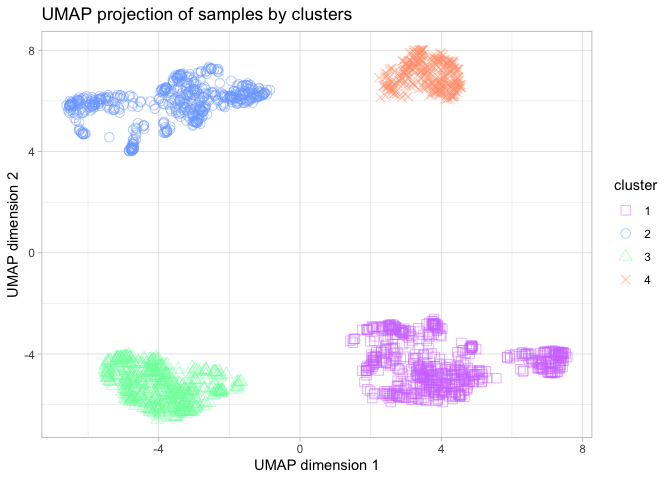

# Import necessary libraries


```r
install.packages('readr')
BiocManager::install('NbClust')
BiocManager::install('umap')
install.packages('ggplot2')
```


```r
library(readr)
library(NbClust)
library(umap)
library(ggplot2)
```

# Open the data

To get the final groups of samples, we will use the previously scaled data using Python; and the same methods applied in the R Markdown clustering_R.

```r
setwd('/Volumes/TOSHIBA/4t/Advanced Bioinformatics/Project/Python/')
data <- read_csv("scaled_data.csv")
data <- data[-1]
t_data <- t(data)
d_matrix <- data.matrix(t_data, rownames.force = NA)
```

# Clustering


```r
umap_result <- umap(t_data, n_components = 2)

nb <- NbClust(data = umap_result$layout, distance = "euclidean", min.nc = 3, 
              max.nc = 8, method = "ward.D2", index = "all") 
```

<!-- -->

```
## *** : The Hubert index is a graphical method of determining the number of clusters.
##                 In the plot of Hubert index, we seek a significant knee that corresponds to a 
##                 significant increase of the value of the measure i.e the significant peak in Hubert
##                 index second differences plot. 
## 
```

<!-- -->

```
## *** : The D index is a graphical method of determining the number of clusters. 
##                 In the plot of D index, we seek a significant knee (the significant peak in Dindex
##                 second differences plot) that corresponds to a significant increase of the value of
##                 the measure. 
##  
## ******************************************************************* 
## * Among all indices:                                                
## * 2 proposed 3 as the best number of clusters 
## * 12 proposed 4 as the best number of clusters 
## * 1 proposed 5 as the best number of clusters 
## * 7 proposed 6 as the best number of clusters 
## * 1 proposed 7 as the best number of clusters 
## 
##                    ***** Conclusion *****                            
##  
## * According to the majority rule, the best number of clusters is  4 
##  
##  
## *******************************************************************
```

```r
nb$All.index
```

```
##        KL        CH  Hartigan      CCC    Scott   Marriot     TrCovW    TraceW
## 3  1.1007  6784.101 4378.9465  59.8243 10238.43 151203226 80755822.0 15090.259
## 4 12.4071 15976.739  811.5901 106.0500 13055.80  64924736  4358654.4  4698.689
## 5  0.7017 17090.870  925.6218 105.7317 14052.82  61358378  1791160.3  3332.165
## 6 21.2978 20245.833  353.9389 112.0454 15445.23  43781075  1615519.5  2269.931
## 7 56.7761 19940.906  281.8643 109.1847 16076.23  43349706   865401.1  1925.256
## 8  0.0060 19560.666  317.9409 106.7092 16549.10  44607311   769449.8  1684.913
##   Friedman   Rubin Cindex     DB Silhouette   Duda  Pseudot2  Beale Ratkowsky
## 3  68.7660  7.8526 0.2783 0.4011     0.7358 0.1556 4613.0095 5.4207    0.5121
## 4  79.0349 25.2194 0.3005 0.3395     0.7769 0.4003  985.8755 1.4960    0.4857
## 5  86.2615 35.5619 0.2571 0.3969     0.7235 0.3813  869.5772 1.6193    0.4389
## 6 118.1039 52.2034 0.3274 0.4531     0.6900 0.6076  341.6757 0.6447    0.4031
## 7 137.5700 61.5493 0.2956 0.6509     0.6405 0.5981  272.0954 0.6702    0.3740
## 8 148.6990 70.3289 0.3115 0.7303     0.5984 0.5377  403.2695 0.8580    0.3504
##        Ball Ptbiserial   Frey McClain   Dunn Hubert SDindex Dindex   SDbw
## 3 5030.0862     0.8578 0.4948  0.4622 0.3680      0  0.3483 2.2797 0.1268
## 4 1174.6723     0.8482 1.3857  0.4314 0.5401      0  0.2960 1.3235 0.0357
## 5  666.4329     0.8007 1.2241  0.4590 0.1184      0  0.5336 1.1272 0.0305
## 6  378.3219     0.7614 2.9770  0.4723 0.0495      0  0.5670 0.9526 0.0214
## 7  275.0366     0.6875 2.6367  0.5598 0.0300      0  1.1805 0.8719 0.0593
## 8  210.6142     0.6487 2.7010  0.6131 0.0335      0  1.1678 0.8134 0.0714
```

```r
nb$Best.nc
```

```
##                      KL       CH Hartigan      CCC    Scott  Marriot   TrCovW
## Number_clusters  7.0000     6.00    4.000   6.0000    4.000        4        4
## Value_Index     56.7761 20245.83 3567.356 112.0454 2817.368 82712132 76397168
##                   TraceW Friedman   Rubin Cindex     DB Silhouette   Duda
## Number_clusters    4.000   6.0000  6.0000 5.0000 4.0000     4.0000 6.0000
## Value_Index     9025.045  31.8425 -7.2956 0.2571 0.3395     0.7769 0.6076
##                 PseudoT2 Beale Ratkowsky     Ball PtBiserial Frey McClain
## Number_clusters   6.0000 4.000    3.0000    4.000     3.0000    2  4.0000
## Value_Index     341.6757 1.496    0.5121 3855.414     0.8578   NA  0.4314
##                   Dunn Hubert SDindex Dindex   SDbw
## Number_clusters 4.0000      0   4.000      0 6.0000
## Value_Index     0.5401      0   0.296      0 0.0214
```


```r
bclust_labels <- nb$Best.partition
table(bclust_labels)
```

```
## bclust_labels
##   1   2   3   4 
## 660 538 471 314
```

# UMAP projection of the results


```r
umap_df <- data.frame(x = umap_result$layout[, 1], y = umap_result$layout[, 2], cluster = as.factor(bclust_labels))

shapes = c(0, 1, 2, 4,5)
cols = c('#D27BFF', '#7BAAFF', '#7BFFAA', '#FF9E7B', 'yellow')

ggplot(umap_df, aes(x=x, y=y, color=cluster, shape=cluster)) + 
  xlab('UMAP dimension 1') + ylab('UMAP dimension 2') + 
  geom_point(alpha=.5, size=3) +
  scale_shape_manual(values = shapes) +
  scale_color_manual(values = cols) +
  ggtitle('UMAP projection of samples by clusters') +
  theme_light()
```

<!-- -->
We can conclude that we have 4 well defined groups of samples, so we are going to store in a file to which cluster each sample belongs, for further analysis.

```r
write.csv(bclust_labels, "cluster_labs.csv", row.names = TRUE)
```
