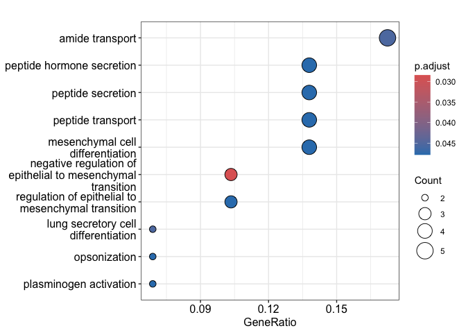
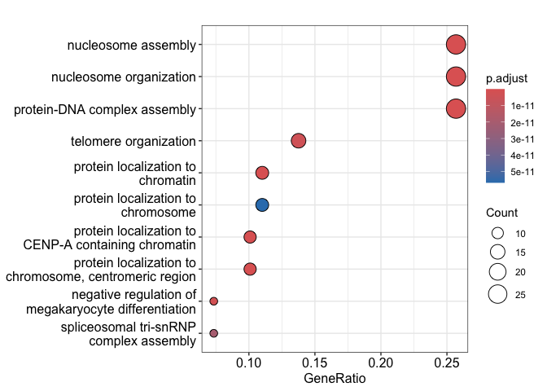
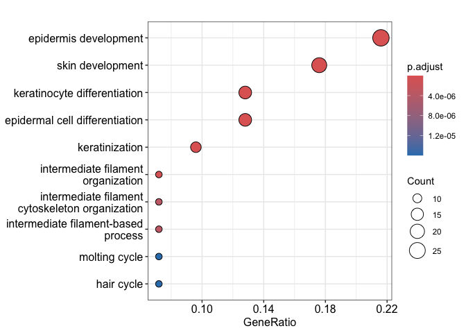
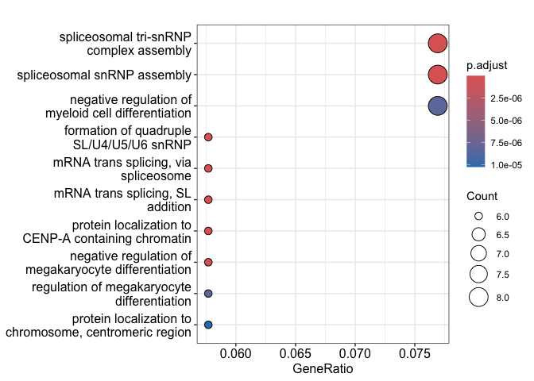
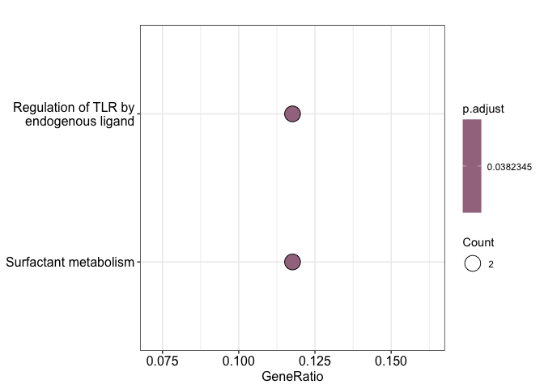
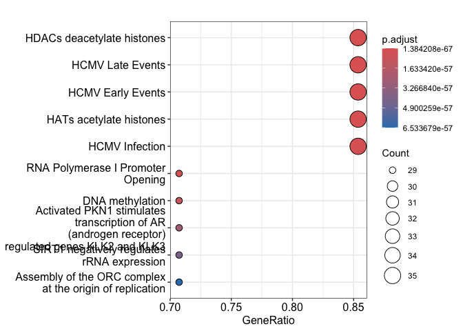
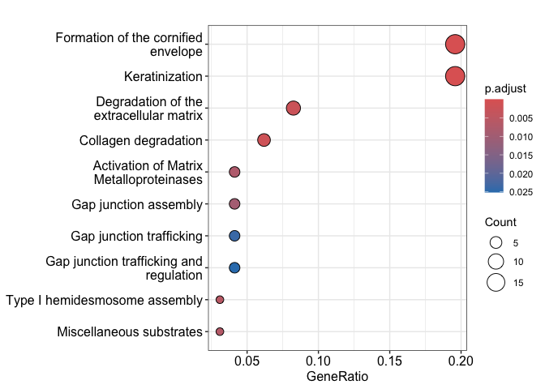

# Import necessary libraries

```r
library(clusterProfiler)
library(org.Hs.eg.db)
library(ReactomePA)
```

# Set the working directory

```r
workingDir <- '/Volumes/TOSHIBA/4t/Advanced Bioinformatics/Project/Python/'
setwd(workingDir)
```

# Open files and select genes
We are going to do the enrichment analysis of the differentially expressed genes in each cluster with GO BP and reactome pathways. To do this, we need to obtain gene Ensembl IDs without their version and then find the corresponding, gene symbol, and Entrez ID.

```r
path1 <- file.path(workingDir, 'cluster_1_degs.csv')
path2 <- file.path(workingDir, 'cluster_2_degs.csv')
path3 <- file.path(workingDir, 'cluster_3_degs.csv')
path4 <- file.path(workingDir, 'cluster_4_degs.csv')

df1 <- read.csv(path1)
df2 <- read.csv(path2)
df3 <- read.csv(path3)
df4 <- read.csv(path4)

g1 <- sub("\\..*", "", df1$Gene[df1$DEGs != 'NORMAL'])
g2 <- sub("\\..*", "", df2$Gene[df2$DEGs != 'NORMAL'])
g3 <- sub("\\..*", "", df3$Gene[df3$DEGs != 'NORMAL'])
g4 <- sub("\\..*", "", df4$Gene[df4$DEGs != 'NORMAL'])

ids_1 <- bitr(g1, fromType = "ENSEMBL", toType = c("SYMBOL","ENTREZID"), OrgDb = org.Hs.eg.db, drop = TRUE)
ids_2 <- bitr(g2, fromType = "ENSEMBL", toType = c("SYMBOL","ENTREZID"), OrgDb = org.Hs.eg.db, drop = TRUE) 
ids_3 <- bitr(g3, fromType = "ENSEMBL", toType = c("SYMBOL","ENTREZID"), OrgDb = org.Hs.eg.db, drop = TRUE)
ids_4 <- bitr(g4, fromType = "ENSEMBL", toType = c("SYMBOL","ENTREZID"), OrgDb = org.Hs.eg.db, drop = TRUE)
```

# Enrichment analysis with GO biological process
For both enrichment analysis with GO BP and Reactome pathways, terms with a gene count of 2 or less will be discarted for biological interpretation.


```r
enrichGO_result_1 <- enrichGO(gene = ids_1$SYMBOL, OrgDb = org.Hs.eg.db, keyType = "SYMBOL", ont = "BP", pAdjustMethod = "BH", qvalueCutoff = 0.05)
enrichGO_result_2 <- enrichGO(gene = ids_2$SYMBOL, OrgDb = org.Hs.eg.db, keyType = "SYMBOL", ont = "BP", pAdjustMethod = "BH", qvalueCutoff = 0.05)
enrichGO_result_3 <- enrichGO(gene = ids_3$SYMBOL, OrgDb = org.Hs.eg.db, keyType = "SYMBOL", ont = "BP", pAdjustMethod = "BH", qvalueCutoff = 0.05)
enrichGO_result_4 <- enrichGO(gene = ids_4$SYMBOL, OrgDb = org.Hs.eg.db, keyType = "SYMBOL", ont = "BP", pAdjustMethod = "BH", qvalueCutoff = 0.05)
dotplot(enrichGO_result_1, showCategory = 10, title = "Enriched GO Biological processes in cluster 1 DEGs")
```

<!-- -->

```r
dotplot(enrichGO_result_2, showCategory = 10, title = "Enriched GO Biological processes in cluster 2 DEGs")
```

<!-- -->

```r
dotplot(enrichGO_result_3, showCategory = 10, title = "Enriched GO Biological processes in cluster 3 DEGs")
```

<!-- -->

```r
dotplot(enrichGO_result_4, showCategory = 10, title = "Enriched GO Biological processes in cluster 4 DEGs")
```

<!-- -->

# Enrichment analysis with reactome pathways

```r
enrich_reactome_1 <- enrichPathway(gene = ids_1$ENTREZID, pvalueCutoff = 0.05)
enrich_reactome_2 <- enrichPathway(gene = ids_2$ENTREZID, pvalueCutoff = 0.05)
enrich_reactome_3 <- enrichPathway(gene = ids_3$ENTREZID, pvalueCutoff = 0.05)
enrich_reactome_4 <- enrichPathway(gene = ids_4$ENTREZID, pvalueCutoff = 0.05)
dotplot(enrich_reactome_1, showCategory = 10, title = "Enriched reactome pathways in cluster 1 DEGs")
```

<!-- -->

```r
dotplot(enrich_reactome_2, showCategory = 10, title = "Enriched reactome pathways in cluster 2 DEGs")
```

<!-- -->

```r
dotplot(enrich_reactome_3, showCategory = 10, title = "Enriched reactome pathways in cluster 3 DEGs")
```

<!-- -->

```r
dotplot(enrich_reactome_4, showCategory = 10, title = "Enriched reactome pathways in cluster 4 DEGs")
```

<!-- -->
